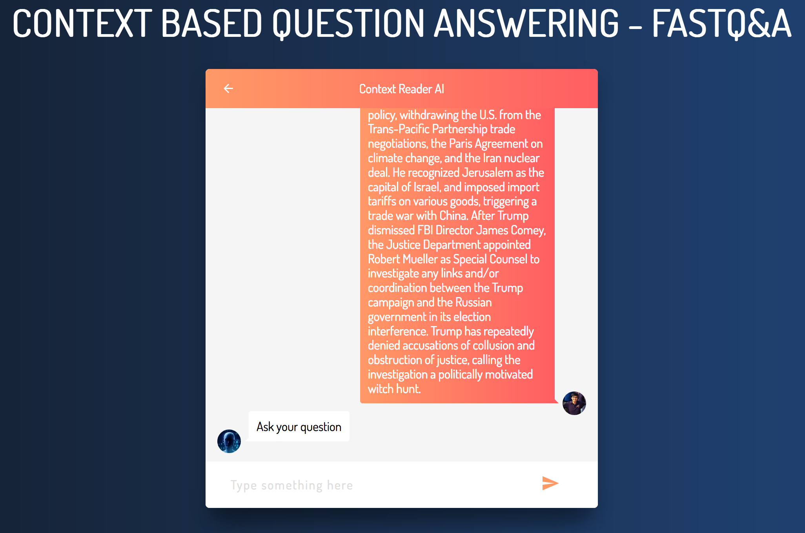
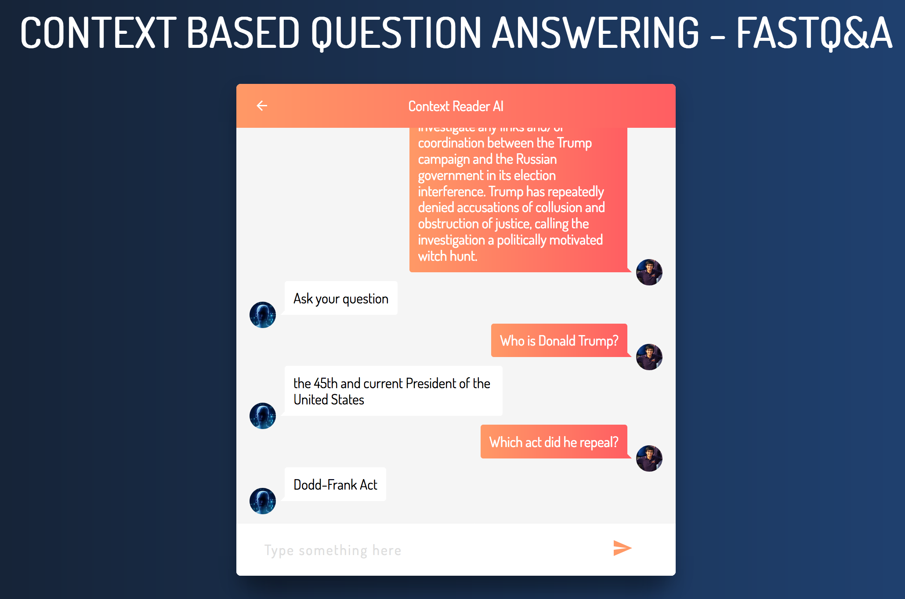

# Prototyping a Context-based Question-Answering System

Conversational AI Systems have seen a meteoric rise in the past few years as Deep Learning Techniques offered increasingly accurate solutions for problems relating to language understanding. We present a model for prototyping chatbots developed using state-of-the-art technology in an attempt to offer a simple, clean interface for researchers developing solutions in this domain.

## Installation

* Clone this repository
	
		$ git clone https://github.com/SwapneelM/Protobot.git

* Create a Python3 virtual environment (we've named it 'venv' here)

		$ virtualenv -p python3 venv
		$ source venv/bin/activate  # or activate.csh depending on your platform

* Install the requirements

		$ pip3 install -r requirements.txt

* Download some data (here, we use the Stanford QA and GloVe datasets)

		$ cd Protobot/
		$ ./data/SQuAD/download.sh
		$ ./data/GloVe/download.sh

* To play around, download the pretrained models

		$ wget -O fastqa.zip https://www.dropbox.com/s/qb796uljoqj0lvo/fastqa.zip?dl=1
		$ unzip fastqa.zip && mv fastqa fastqa_reader

* Run the migrations for creating the database for the django webapp

        $ python manage.py makemigrations
        $ python manage.py migrate

* Run the server and visit `localhost:8000` on your browser to see the result

        $ python manage.py runserver

* Of course, you can always train your own model(s)

		$ python3 bin/jack-train.py with train='data/SQuAD/train-v1.1.json' dev='data/SQuAD/dev-v1.1.json' reader='fastqa_reader' \
		> repr_dim=300 dropout=0.5 batch_size=64 seed=1337 loader='squad' save_dir='./fastqa_reader' epochs=20 \
		> with_char_embeddings=True embedding_format='memory_map_dir' embedding_file='data/GloVe/glove.840B.300d.memory_map_dir' vocab_from_embeddings=True

or using a pre-defined configuration

		$ python3 bin/jack-train.py with config='./conf/qa/squad/fastqa.yaml'

* Refer to the documentation for [Jack the Reader](JACK-README.md) for more information on playing around with the models.

## Usage

#### Provide the Context Paragraph to the System
* You can also provide a document instead of plaintext as context, check out [custom_test.py](custom_test.py) for reference on how to read from a document.

#### Ask Away!

## References

This app draws mainly from two sources used as building blocks for the context-based question answering system:

1. [Jack the Reader: A Machine Reading Comprehension framework by Dirk Weissenborn et. al](https://github.com/uclmr/jack)

2. [Chat with Iron Man, by Kurt Lopez](https://codepen.io/kurtlopez/full/gevzRW)

### Developed By [CC Developers](http://www.ccdev.in)

* [Rudresh Panchal](https://github.com/rpanchal1996)
* [Avais Pagarkar](https://github.com/avaisp)
* [Swapneel Mehta](https://github.com/swapneelm)

**Shameless Plug:** Check out our student community and their projects, [DJ Unicode](https://github.com/djunicode)!
